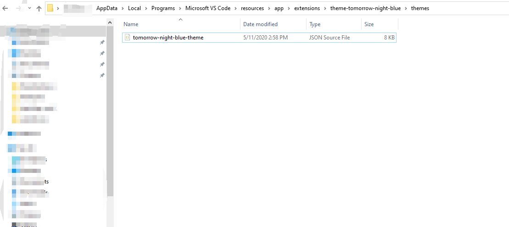

# Customizing VS Code Theme

Customizing your VS Code Theme is easier than you thought, I am using Windows and the already awesome Tomorrow Night Blue theme in VS code.

## Create Backup of the current Color Theme

1. Locate your VS code color Theme

Normally your vs code color theme is located in the Microsoft VS Code installation folder.

In my case I am using Windows and my vs installation folder code is located
`C:\Users\myUsername\AppData\Local\Programs\Microsoft VS Code\`

If your main installation folder is located somewhere else, head there and navigate through the folder until you get to the main active color theme.

```
Microsoft VS Code\resources\app\extensions\theme-tomorrow-night-blue\themes
```

##### Full path:

C:\Users\myUsername\AppData\Local\Programs\Microsoft VS Code\resources\app\extensions\AnyActiveTheme\themes



2. Copy the origin JSON file or follow your own Backup method

I just created a folder in my Documents directory and copy and pasted the current JSON file there. Please feel free to create your backup on your own way.

---

## Modify the Color Theme

My favorite Color Theme is the Tomorrow Night Blue, but there are couple of things that I completely dislike about the theme so I updated according to my own taste. Let's get to it.

1. Open the Color Theme JSON file in your VS Code

2. Open any existent project you might have (HTML, CSS, JS)
   The main point here is to analyze the current elements style, so you can change it.

##### To modify the color theme you will need to follow four simple steps - Highlight the element you want to change the color, Open the Developer Inspect Editor Tokens And Scopes, Grab the scope name of the element, and locate/change it on the JSON file.

1. Highlight the element you want to change the color
   A. After the element is highlighted - Right-Click on it
   B. and click on the Command Pallet option
   or
   Click on CTRL+SHIFT+P


2. Open the Developer Inspect Editor Tokens And Scopes
   A. Search for the Developer Inspect Editor Tokens And Scopes
   B. Click on it


3. Grab the scope name of the element
   A. Highlight any part of your code
   B. The Developer Inspect Editor Tokens And Scopes will give a set of information of the highlighted element


